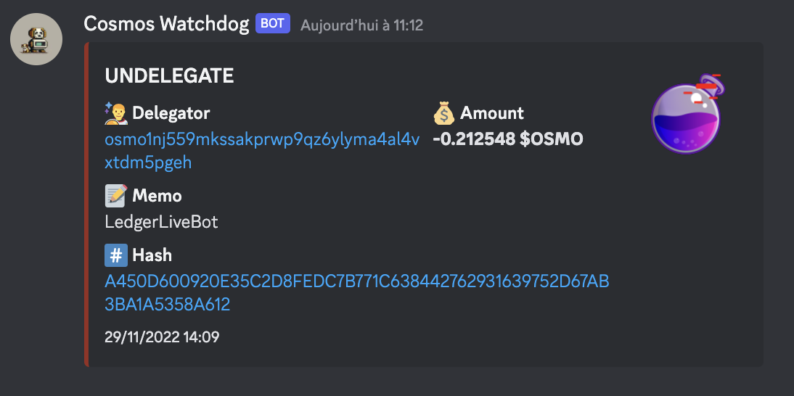
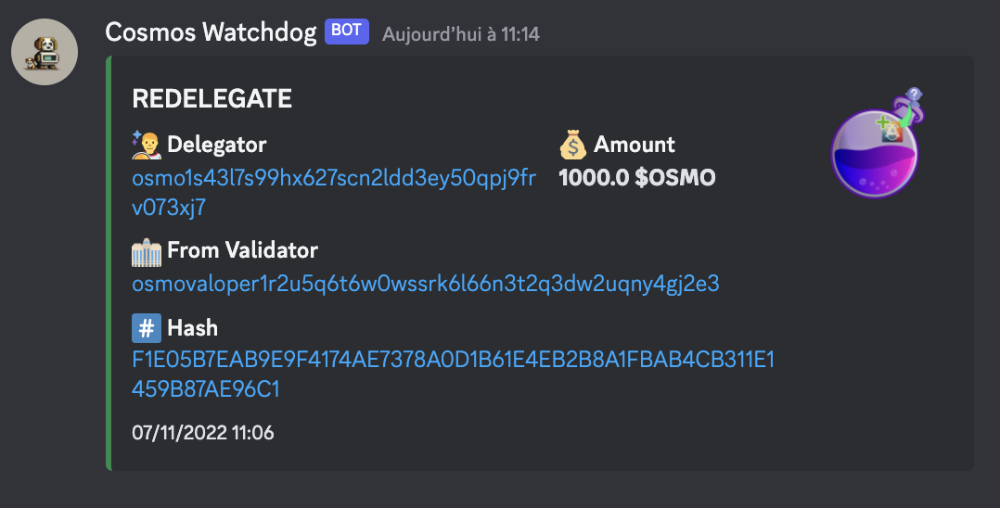
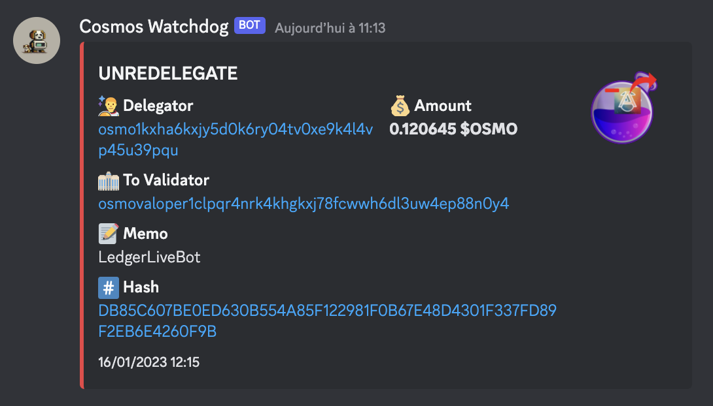
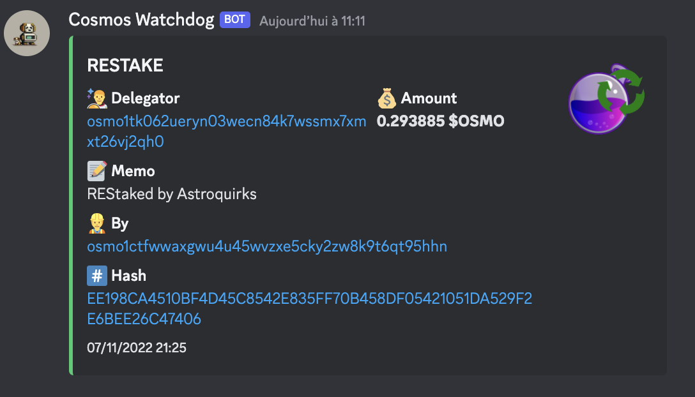
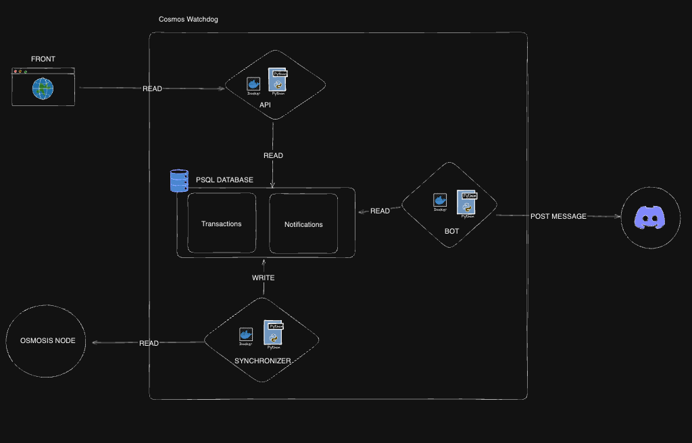

<h1 style="display:inline; position: absolute; margin-left: 10px; margin-top: 60px" >Cosmos Watchdog</h1>


Cosmos Watchdog is a tool that allows you to synchronize all transactions of different types for a given validator and receive notifications on a Discord Channel when new transactions are seen.

For now only the osmosis blockchain is supported

## Supported Transactions

### DELEGATE


### UNDELEGATE




### REDELEGATE




### UNREDELEGATE




### RESTAKE




## Architecture




## Installation

To install Cosmos Watchdog, clone the repository and install the dependencies with Pipenv:
```bash
git clone https://github.com/astroquirks/cosmos-watchdog.git
cd cosmos-watchdog
pipenv install
```

## Usage
Cosmos Watchdog provides a command-line interface (CLI) to interact with the tool. Here are the available commands:

### Synchronization

To synchronize transactions related to a given validator, use the following command:
The address argument specifies the validator address, and the optional tx-type argument(s) specify the type(s) of transactions to synchronize (e.g., REDELEGATE, DELEGATE, RESTAKE, UNDELEGATE, UNREDELEGATE).
If no tx-type is specified, all transaction types will be synchronized.

```
Usage: pipenv run synchronize [OPTIONS] ADDRESS

Options:
  -t, --tx-type [restake|delegate|undelegate|redelegate|unredelegate]
                                  Transaction type(s) to synchronize
                                  If not set, all transactions types
                                  will be synchronized
  --notify                        To notify upon new transactions
  --help                          Show this message and exit.
```

### Wipe Transactions
To delete transactions related to a given validator, use the following command:

```
Usage: pipenv run wipe [OPTIONS]

Options:
  -t, --tx-type [restake|delegate|undelegate|redelegate|unredelegate]
                                  Transaction type(s) to wipe.
                                  If not set, all transactions types
                                  will be wiped
  --from-offset INTEGER           Wipe all transactions from offset
  --help                          Show this message and exit.
```

### Notify

To send a notification for a given transaction ID

```
Usage: pipenv run notify [OPTIONS]

Options:
  -t, --tx-id INTEGER  Transaction id to create a notification for
  --help               Show this message and exit.
```

## Configuration

You can configure Cosmos Watchdog using environment variables. Here are the available variables:
```
SYNCHRONIZER_VALIDATOR_ADDRESS: The validator address to synchronize transactions from.
SYNCHRONIZER_FREQUENCY: The synchronization frequency in seconds.
SYNCHRONIZER_NOTIFY: The synchronization frequency in seconds.
DB_SCHEMA,DB_USER, DB_HOST, DB_PORT, and DB_PASSWORD: The database connection parameters.
BOT_FREQUENCY: The notification frequency in seconds.
BOT_TOKEN: The auth token of your bot
BOT_CHANNEL_ID: The ID of the Discord channel
```


## Start the synchronizer 

### Using local code
```bash
# config is taken from config.yaml file
pipenv run start-synchronizer
```

### docker image
```bash
docker run -e SYNCHRONIZER_VALIDATOR_ADDRESS=<SYNCHRONIZER_VALIDATOR_ADDRESS> -e SYNCHRONIZER_FREQUENCY=<SYNCHRONIZER_FREQUENCY> -e SYNCHRONIZER_NOTIFY=<SYNCHRONIZER_NOTIFY> ghcr.io/astroquirkshq/cosmos-watchdog:<IMAGETAG>-sync
```

## Start the discord bot

### Using local code
```shell
# config is taken from config.yaml file
pipenv run bot
```

### docker image
```shell
docker run -e BOT_TOKEN=<BOT_TOKEN> -e BOT_CHANNEL_ID=<CHANNEL_ID> -e BOT_FREQUENCY=<BOT_FREQUENCY> ghcr.io/astroquirkshq/cosmos-watchdog:<IMAGETAG>-bot
```


## Start the flask server

### Using local code
```shell
# config is taken from config.yaml file
pipenv run server 
```

### docker image
```shell
docker run -e API_HOST=<API_HOST> -e API_PORT=<API_PORT> ghcr.io/astroquirkshq/cosmos-watchdog:<IMAGETAG>-api
```


## Testing

To run the tests, use the following command:

```shell
pipenv run tests
```

## Linting

To run the linter, use the following command:

```shell
pipenv run lint
```


# TODO :

## COSMOS-WATCHDOG
- test with stargaze
- add docker-compose

## CORE
- add db migration support
- add missing unit tests


## SYNCHRONIZER
- add NOTIFY_ON_INITIAL_SYNC env variable option
- find a smart way to handle restake for all kind of tx type
- find a way to group restake notifications
- add integration tests synchronizer
- add missing unit tests
- add multi-currency support

## CLI
- support wipe-notification

## BOT
- support validator name
- add integration tests discord bot
- add missing unit tests
- Expose discord command to :
   - get balance
   - get list of delegators
   - get stats of my validator
     - balance
     - nb delegators
   - get my history

## API
- Expose delegation history through api endpoint by delegator
- Expose delegation history through api endpoint by validator 

