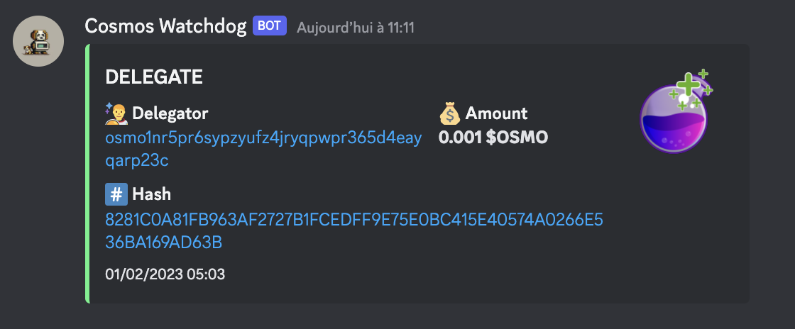

# Cosmos Watchdog

Cosmos Watchdog is a tool that allows you to synchronize all transactions of different types for a given validator and receive notifications on a Discord Channel when new transactions are seen.

For now only the osmosis blockchain is supported

## Supported Transactions

### DELEGATE



### UNDELEGATE


### REDELEGATE


### UNREDELEGATE


### RESTAKE 


## Installation

To install Cosmos Watchdog, clone the repository and install the dependencies with Pipenv:
```bash
git clone https://github.com/astroquirks/cosmos-watchdog.git
cd cosmos-watchdog
pipenv install
```

## Usage
Cosmos Watchdog provides a command-line interface (CLI) to interact with the tool. Here are the available commands:

### Synchronization

To synchronize transactions related to a given validator, use the following command:
The address argument specifies the validator address, and the optional tx-type argument(s) specify the type(s) of transactions to synchronize (e.g., REDELEGATE, DELEGATE, RESTAKE, UNDELEGATE, UNREDELEGATE).
If no tx-type is specified, all transaction types will be synchronized.

```
Usage: pipenv run synchronize [OPTIONS] ADDRESS

Options:
  -t, --tx-type [restake|delegate|undelegate|redelegate|unredelegate]
                                  Transaction type(s) to synchronize
                                  If not set, all transactions types
                                  will be synchronized
  --notify                        To notify upon new transactions
  --help                          Show this message and exit.
```

### Wipe Transactions
To delete transactions related to a given validator, use the following command:

```
Usage: pipenv run wipe [OPTIONS]

Options:
  -t, --tx-type [restake|delegate|undelegate|redelegate|unredelegate]
                                  Transaction type(s) to wipe.
                                  If not set, all transactions types
                                  will be wiped
  --from-offset INTEGER           Wipe all transactions from offset
  --help                          Show this message and exit.
```

### Notify

To send a notification for a given transaction ID

```
Usage: pipenv run notify [OPTIONS]

Options:
  -t, --tx-id INTEGER  Transaction id to create a notification for
  --help               Show this message and exit.
```

## Start the synchronizer 

```bash
pipenv run synchronizer
```

NOTE: this needs to be a docker image to run

## Start the discord bot

```bash
DISCORD_TOKEN=XXX pipenv run bot
```

NOTE: this needs to be a docker image to run

## Configuration

You can configure Cosmos Watchdog using environment variables. Here are the available variables:
```
SYNCHRONIZER_VALIDATOR_ADDRESS: The validator address to synchronize transactions from.
SYNCHRONIZER_FREQUENCY: The synchronization frequency in seconds.
DB_SCHEMA, DB_USER, DB_HOST, DB_PORT, and DB_PASSWORD: The database connection parameters.
BOT_FREQUENCY: The notification frequency in seconds.
BOT_TOKEN: The auth token of your bot
BOT_CHANNEL_ID: The ID of the Discord channel
```

## Testing

To run the tests, use the following command:

```bash
pipenv run tests
```

## Linting

To run the linter, use the following command:

```bash
pipenv run lint
```


TODO : 

- Add docker images
- Improve separation between synchronizer, flask http interface, discord bot
- use colors https://gist.github.com/kkrypt0nn/a02506f3712ff2d1c8ca7c9e0aed7c06#file-ansi-colors-showcase-md
- Expose discord command to :
   - get balance
   - get list of delegators
   - get stats of my validator
     - balance
     - nb delegators
   - get my history